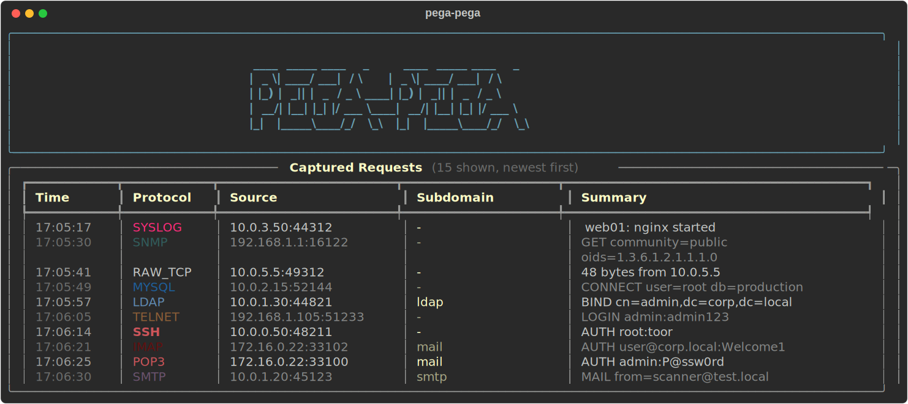
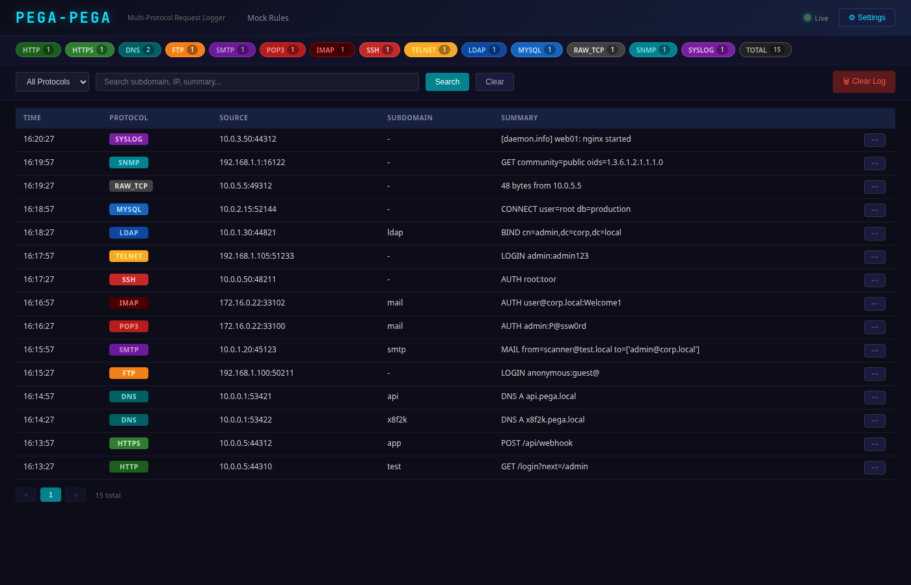

# pega-pega

Multi-protocol request logger and catcher. Think Responder meets Burp Collaborator — listens on 14 protocols, logs every incoming request, and displays them in a rich terminal UI and web dashboard.

```
  ____  _____ ____    _        ____  _____ ____    _
 |  _ \| ____/ ___|  / \      |  _ \| ____/ ___|  / \
 | |_) |  _|| |  _  / _ \ ____| |_) |  _|| |  _  / _ \
 |  __/| |__| |_| |/ ___ \____|  __/| |__| |_| |/ ___ \
 |_|   |_____\____/_/   \_\   |_|   |_____\____/_/   \_\
```

## Protocols

| Protocol | Default Port | Extra Ports | What's captured |
|----------|-------------|-------------|-----------------|
| HTTP | 80 | 8080, 8888, 3000, 5000, 8000, 8081 | Method, path, headers, body, query params |
| HTTPS | 443 | 4443, 9443 | Same as HTTP (auto-generated wildcard cert) |
| DNS | 53 | Query name, type — responds with your IP |
| FTP | 21 | Credentials, commands |
| SMTP | 25 | EHLO, AUTH creds, envelope, mail body |
| POP3 | 110 | Login credentials |
| IMAP | 143 | Login credentials, commands |
| SSH | 22 | Password and pubkey auth attempts |
| Telnet | 23 | Login credentials, raw input |
| LDAP | 389 | Bind DN/credentials, search queries |
| MySQL | 3306 | Username, database, auth data |
| Raw TCP | 9999 | Hex dump of anything |
| SNMP | 161 | Community strings, OIDs |
| Syslog | 514 | Facility, severity, message |

All handlers return **realistic responses** to encourage clients to send full payloads.

## Features

- **Subdomain tracking** — DNS responds with your IP for all queries, HTTP extracts subdomain from Host header
- **Rich terminal UI** — color-coded live table with protocol tags
- **Web dashboard** — real-time updates via WebSocket, filtering, search, hex viewer (port 8443)
- **SQLite persistence** — all captured requests stored and queryable
- **Configurable** — YAML config to enable/disable protocols, remap ports, set bind addresses

## Screenshots

### Terminal UI

<p align="center">
  
</p>

### Web Dashboard

<p align="center">
  
</p>

## Quick install (on a server)

```bash
curl -sSL https://raw.githubusercontent.com/caioluders/pega-pega/main/install.sh | sudo bash
```

With options:

```bash
curl -sSL https://raw.githubusercontent.com/caioluders/pega-pega/main/install.sh | sudo bash -s -- \
  --domain yourdomain.com \
  --ip 1.2.3.4
```

This clones the repo, installs into `/opt/pega-pega`, creates a systemd service, and starts it. Dashboard will be at `http://server:8443`.

### Install options

```
  --domain, -d DOMAIN    Base domain for subdomain tracking (default: pega.local)
  --ip, -i IP            IP to return in DNS responses (default: auto-detect)
  --dashboard PORT       Web dashboard port (default: 8443)
  --no-service           Install only, don't create systemd service
  --update               Update existing installation from GitHub
  --uninstall            Remove pega-pega completely
```

### After installing

Point your domain's DNS to the server:
- Set a wildcard A record: `*.yourdomain.com → server_ip`
- Or set an NS record so pega-pega handles DNS directly

Manage the service:
```bash
journalctl -u pega-pega -f          # live logs
systemctl restart pega-pega         # restart
vim /etc/pega-pega/config.yaml      # edit config
```

Update to latest version:
```bash
curl -sSL https://raw.githubusercontent.com/caioluders/pega-pega/main/install.sh | sudo bash -s -- --update
```

Uninstall:
```bash
curl -sSL https://raw.githubusercontent.com/caioluders/pega-pega/main/install.sh | sudo bash -s -- --uninstall
```

## Local development

```bash
git clone https://github.com/caioluders/pega-pega.git
cd pega-pega
python3 -m venv .venv
source .venv/bin/activate
pip install -e .
sudo pega-pega
```

## Usage

```bash
# Run all protocols (needs root for ports < 1024)
sudo pega-pega

# Run specific protocols
pega-pega -p http,dns,ftp

# Custom domain and response IP
pega-pega -d yourdomain.com -r 1.2.3.4

# Custom config file
pega-pega -c config.default.yaml

# Disable web dashboard
pega-pega --no-dashboard
```

### CLI options

```
  -c, --config PATH        Path to config YAML file
  -b, --bind IP            IP to bind all listeners (default: 0.0.0.0)
  -d, --domain DOMAIN      Base domain for subdomain tracking
  -r, --response-ip IP     IP to return in DNS responses (auto-detect if not set)
  --dashboard-port PORT    Web dashboard port (default: 8443)
  --db PATH                SQLite database path
  --no-dashboard           Disable web dashboard
  -p, --protocols LIST     Comma-separated list of protocols to enable
  -v, --verbose            Verbose logging
```

## Configuration

See [`config.default.yaml`](config.default.yaml) for all options. Key settings:

```yaml
bind_ip: "0.0.0.0"
domain: "yourdomain.com"     # base domain for subdomain tracking
response_ip: ""              # IP for DNS responses (auto-detect if empty)
dashboard_port: 8443
db_path: "pega_pega.db"

protocols:
  http:
    enabled: true
    port: 80
    extra_ports: [8080, 8888, 3000, 5000, 8000, 8081]
  https:
    enabled: true
    port: 443
    extra_ports: [4443, 9443]
  dns:
    enabled: true
    port: 53
  # ... see config.default.yaml for all 14 protocols
```

## Architecture

```
pega_pega/
├── models.py            # CapturedRequest dataclass, Protocol enum
├── bus.py               # Async fan-out event bus
├── store.py             # SQLite persistence
├── display.py           # Rich terminal live table
├── server.py            # Main orchestrator
├── cli.py               # Click CLI
├── certs.py             # Self-signed certificate generation
├── config.py            # YAML config loading
├── protocols/           # 14 protocol handlers
│   ├── base.py          # BaseProtocolHandler ABC
│   ├── http_handler.py
│   ├── dns_handler.py
│   ├── ssh_handler.py
│   └── ...
├── dashboard/           # FastAPI web dashboard
│   ├── app.py
│   └── templates/
└── utils/               # DNS/LDAP/SNMP wire-format parsers
```

Every protocol handler publishes `CapturedRequest` events to a central async event bus. Consumers (SQLite store, terminal display, WebSocket broadcaster) each subscribe independently.
