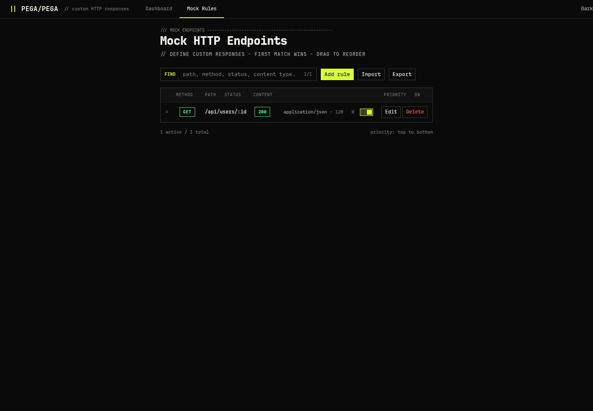

# pega-pega

Multi-protocol request catcher. **14 protocols**, web dashboard, NTLM hash capture, mock HTTP endpoints.

```
  ____  _____ ____    _        ____  _____ ____    _
 |  _ \| ____/ ___|  / \      |  _ \| ____/ ___|  / \
 | |_) |  _|| |  _  / _ \ ____| |_) |  _|| |  _  / _ \
 |  __/| |__| |_| |/ ___ \____|  __/| |__| |_| |/ ___ \
 |_|   |_____\____/_/   \_\   |_|   |_____\____/_/   \_\
```

## Screenshots

<p align="center">
  
</p>
<p align="center">
  
</p>

## Install

```bash
curl -sSL https://raw.githubusercontent.com/caioluders/pega-pega/main/install.sh | sudo bash -s -- \
  --domain yourdomain.com \
  --ip 1.2.3.4 \
  --letsencrypt --email admin@yourdomain.com \
  --password s3cret
```

Point a wildcard DNS record (`*.yourdomain.com`) to your server.

### Docker

```bash
docker run -d --network host --name pega-pega \
  -v pega-data:/data \
  ghcr.io/caioluders/pega-pega \
  -d yourdomain.com -r 1.2.3.4 --db /data/pega_pega.db
```

Or with docker compose:

```bash
git clone https://github.com/caioluders/pega-pega.git
cd pega-pega
# edit docker-compose.yml to set domain/ip/password
docker compose up -d
```

`--network host` is required so all 14 protocol ports bind directly.

<details>
<summary>Options & service management</summary>

```
--domain, -d DOMAIN    Base domain (default: pega.local)
--ip, -i IP            Response IP for DNS (default: auto-detect)
--dashboard PORT       Web dashboard port (default: 8443)
--password PASS        Dashboard password (empty = no auth)
--letsencrypt          SSL via certbot
--email, -e EMAIL      Email for Let's Encrypt
--no-service           Don't create systemd service
--update               Update existing installation
--uninstall            Remove completely
```

```bash
journalctl -u pega-pega -f      # logs
systemctl restart pega-pega     # restart
vim /etc/pega-pega/config.yaml  # config
```
</details>

## Usage

```bash
sudo pega-pega                          # all protocols (root for ports < 1024)
pega-pega -p http,dns,ftp               # specific protocols
pega-pega -d yourdomain.com -r 1.2.3.4  # custom domain + IP
pega-pega --no-dashboard                # headless
```

## Protocols

| Protocol | Port | Captured |
|----------|------|----------|
| HTTP | 80 (+8080, 8888, 3000, 5000, 8000, 8081) | Method, path, headers, body |
| HTTPS | 443 (+4443, 9443) | Same as HTTP (wildcard cert) |
| DNS | 53 | Query name/type, responds with your IP |
| FTP | 21 | Credentials, commands |
| SMTP | 25 | EHLO, AUTH, envelope, body |
| POP3 | 110 | Login credentials |
| IMAP | 143 | Login credentials, commands |
| SSH | 22 | Password + pubkey auth attempts |
| Telnet | 23 | Credentials, raw input |
| LDAP | 389 | Bind DN/creds, search queries |
| MySQL | 3306 | Username, database, auth data |
| Raw TCP | 9999 | Hex dump |
| SNMP | 161 | Community strings, OIDs |
| Syslog | 514 | Facility, severity, message |

All handlers return realistic responses to keep clients talking.

## Features

- **Web dashboard** — live request log, protocol stats, sparkline graphs, WebSocket updates
- **Request detail drawer** — parsed fields, headers, body, hex dump, copy curl
- **NTLM hash capture** — force NTLM auth on mock endpoints, extract NTLMv2 hashes (Hashcat 5600 / John netntlmv2)
- **Mock HTTP endpoints** — custom responses with path patterns, status codes, headers, file uploads, code editor with JSON/XML validation
- **Subdomain tracking** — wildcard DNS + Host header extraction
- **IP blocking** — filter noise from all views/stats
- **Let's Encrypt** — auto SSL via certbot
- **SQLite persistence** — all requests stored and queryable
- **Dashboard auth** — optional password protection

## NTLM Hash Capture

Enable "Capture NTLM hash" on any mock rule. The handler performs a full NTLM handshake over keep-alive:

1. Client request → `401 + WWW-Authenticate: NTLM`
2. Client Type 1 → Server Type 2 (challenge)
3. Client Type 3 → **hash extracted**, shown in request details

Output format (Hashcat mode 5600):
```
user::DOMAIN:server_challenge:nt_proof_str:blob
```

Works with browsers (intranet zone), curl `--ntlm`, and any NTLM-capable client.

## Mock HTTP Endpoints

Configure at `/mock` on the dashboard.

- **Path patterns:** `/exact`, `/api/:id` (segment wildcard), `/static/*` (catch-all)
- **Method filter:** GET, POST, PUT, DELETE, PATCH, or ANY
- **Response:** status code, body (with syntax validation), Content-Type, custom headers, file upload
- **Priority:** top-down, first match wins, drag to reorder
- **NTLM:** per-rule toggle to force NTLM authentication and capture hashes

## Configuration

See [`config.default.yaml`](config.default.yaml) for all options.

```yaml
bind_ip: "0.0.0.0"
domain: "yourdomain.com"
response_ip: ""              # auto-detect if empty
dashboard_port: 8443
dashboard_password: ""       # empty = no auth
db_path: "pega_pega.db"

protocols:
  http:
    enabled: true
    port: 80
    extra_ports: [8080, 8888, 3000, 5000, 8000, 8081]
  # ... see config.default.yaml
```

## Development

```bash
git clone https://github.com/caioluders/pega-pega.git
cd pega-pega
pip install -e .
sudo pega-pega
```

## Architecture

```
Protocol Handlers → EventBus → Store (SQLite)
                             → Terminal Display (Rich)
                             → Dashboard WebSocket (live updates)
```

14 async protocol handlers publish `CapturedRequest` events to a fan-out bus. Consumers (store, display, WebSocket) subscribe independently.
